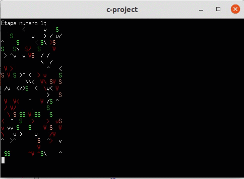

# covid-simulation

The project is a simulation of the spread of corona virus.
Each cell of the grid can either contain:
- A virus
- A normal person (Bonhomme)
- A caregiver (Soignant)

Cells are initialized with random values.

## Built With

* [C 99](https://docs.microsoft.com/en-us/cpp/c-language)
* [Codeblocks](http://www.codeblocks.org/)

## Author

* **Nadhem Maaloul**
